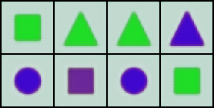
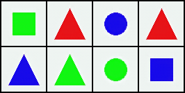
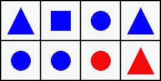

# Conditional Generative Model: P(shape) × P(color | shape)

This project implements a **conditional generative model** for colorizing shapes, based on the factorization:

\[
P(\text{shape}, \text{color}) \approx P(\text{shape}) \times P(\text{color} \mid \text{shape})
\]

It is part of a broader study inspired by the paper **"Compositional Generative Modeling: A Single Model is Not All You Need"**. The goal is to evaluate compositional generalization and compare it against other factorizations (joint, mean-field, etc.).

---

## ✅ Project Overview

- **Task:** Given a grayscale shape (circle, square, triangle), predict its colorized version (RGB).
- **Colors:** Red, Green, Blue
- **Shapes:** Circle, Square, Triangle
- **Challenge:** Generalize to unseen shape-color combinations (e.g., green triangle, blue circle).

---

## ✅ Architecture

The colorization network is a small **encoder-decoder CNN**:

- **Input:** 1×64×64 grayscale image
- **Output:** 3×64×64 color image
- Includes BatchNorm and ReLU activations
- Final layer uses `Sigmoid` for pixel values in [0,1]

---

### **Key Files**
- `color_mapper.py` – CNN architecture
- `color_dataset.py` – PyTorch dataset for grayscale → RGB
- `scripts/train_color_mapper.py` – Training loop with edge-aware loss
- `scripts/view_results.ipynb` – Visualization notebook
- `samples/cond1/` – Generated outputs

---

## ✅ Results

Training for **50 epochs** on a dataset of 300 colored shapes.

| Epoch | Example Output |
|-------|---------------|
| 5     |  |
| 25    |  |
| 50    |  |

### **Observations**
- Early epochs: Color is blurry and inconsistent
- Mid epochs (25): Clean shape-color alignment, minimal bleeding
- Final epochs (50): Sharp colors, strong shape boundaries
- **Limitation:** Unseen combinations (e.g., green triangle) are still missing → confirms compositional generalization challenge

---

## ✅ How to Run

1. Clone the repo:
   ```bash
   git clone https://github.com/isjustabhi/shape_color_cond1_color_given_shape.git
   cd shape_color_cond1_color_given_shape
